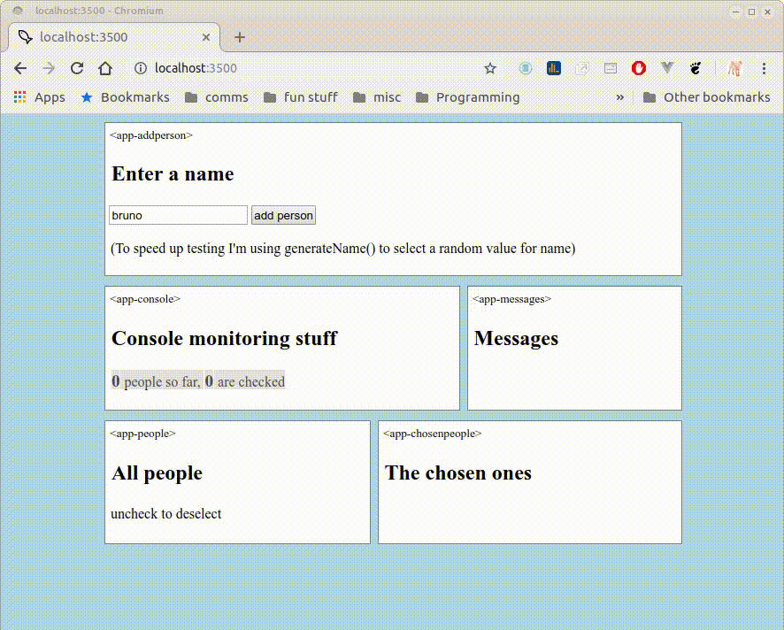

# web components demo with simple pubsub pattern

[No frameworks](https://dev.to/gypsydave5/why-you-shouldnt-use-a-web-framework-3g24), just pure JavaScript ES6.

It uses built-in ES6 webcomponents and the pubsub pattern to allow each component to subscribe and/or publish to the datastore. In 300 lines of pure Javascript.



### why?

Recently I did the usual `npx create-react-app myapp` and while waiting for it to build I realized that it was producing an *awful* lot of code.

To check, I then ran [tokei](https://github.com/XAMPPRocky/tokei) on the clean install:

```
-------------------------------------------------------------------------------
 Language            Files        Lines         Code     Comments       Blanks
-------------------------------------------------------------------------------
 Autoconf                1          389          226          128           35
 BASH                    2           55           41            3           11
 CoffeeScript           30         2156         1504           60          592
 CSS                    38         1827         1704           24           99
 Handlebars              3           92           77            0           15
 HTML                   58         8598         8389           67          142
 JavaScript          23409      2988527      1990585       618054       379888
 JSON                 2197       233727       233727            0            0
 Makefile               44         1875         1209          196          470
 Markdown             2985       549713       549713            0            0
 Module-Definition       5          540          452            0           88
 Shell                   8         1207          937           96          174
 SVG                     5           27           27            0            0
 Plain Text             81         6863         6863            0            0
 TOML                    1           41           39            0            2
 TypeScript           1708       158430        64152        88341         5937
 XML                     2         2192         1948           11          233
 YAML                    7          107           92            8            7
-------------------------------------------------------------------------------
 Total               30584      3956366      2861685       706988       387693
```
Yikes! 23 thousand+ files, nearly 2 MILLION lines of JavaScript and I haven't even written anything yet?

And then Microsoft announced they were giving up developing their own browser [and going with chromium](https://www.theverge.com/2019/4/8/18300077/microsoft-edge-chromium-canary-development-release-download).

Suddenly I saw the light. Plain ES6 web components and no frameworks. Hence this demo, which clocks in as follows:
```-------------------------------------------------------------------------------
 Language            Files        Lines         Code     Comments       Blanks
-------------------------------------------------------------------------------
 CSS                     1           53           46            0            7
 HTML                    1           23           20            0            3
 JavaScript             11          397          300           38           59
 Markdown                1          118          118            0            0
-------------------------------------------------------------------------------
 Total                  14          591          484           38           69

├── css
│   └── style.css
├── demo.gif
├── favicon.ico
├── index.html
├── js
│   ├── components
│   │   ├── app-addperson.js
│   │   ├── app-chosenpeople.js
│   │   ├── app-chosenperson.js
│   │   ├── app-console.js
│   │   ├── app-messages.js
│   │   ├── app-people.js
│   │   ├── app-person.js
│   │   └── app-rootelement.js
│   ├── main.js
│   └── pubsub
│       ├── datastore.js
│       └── pubsub.js
└── README.md
```
### how does it work?
Objects that have something to say publish a string of NewInfo and an object of data:
```
    this.pubsub.publish('NewPerson', person);
    this.pubsub.publish('Message', {"component": "app-addperson", "text": "adding " + person.name});
```
Objects that are interested in those news items subscribe to 'NewPerson'/'Message'/'SomeEvent' etc, state what info they want, pass parameters if needed (eg id) and give the callback function they want to be fired:
```
    this.pubsub.subscribe('NewPerson', 'getChosenPeople', null, this.renderData);
```
I could have wrapped all requests in an object, so instead of 
<pre>
    this.pubsub.subscribe(<b>'NewPerson'</b>, 'getChosenPeople', null, this.renderData);
    this.pubsub.subscribe(<b>'ChangePerson'</b>, 'getChosenPeople', null, this.renderData);
    this.pubsub.subscribe(<b>'DeletePerson'</b>, 'getChosenPeople', null, this.renderData);
</pre>
we would have
<pre>
this.pubsub.subscribe(<b>{'NewPerson','ChangePerson','DeletePerson'}</b>, 'getChosenPeople', null, this.renderData);
</pre>
but then it would be more tricky to assign specific requests/callbacks to each NewInfo.

Also I've not bothered with shadow dom as I like using Bootstrap to control overall css. If you want to add it, it's an easy two-part step:

* attach the shadow to the root after super() in all constructors:
<pre>
constructor(){
    super();
    <b>this.root = this.attachShadow({mode: 'open'});</b>
    // etc
}
</pre>
* change all `this.innerHTML` references to `this.root.innerHTML`

Finally, I've used [James Johnson's](http://jelly.codes/articles/javascript-es6-autobind-class/) excellent code to autobind 'this' for methods instead of having to do it in every class. So originally I had something like:
<pre>class appAddperson extends HTMLElement {}</pre>
I now have:
<pre>class appAddperson extends RootElement {}</pre>
and RootElement (with James' code) extends HTMLElement.

It did need a couple of changes:
// 1) c[urrCls.__proto__](https://developer.mozilla.org/en-US/docs/Web/JavaScript/Reference/Global_Objects/Object/proto) is deprecated in favor of Object.getPrototypeOf(currCls)
// 2) Object.getPrototypeOf(currCls) needs to be checked for null/undefined, hence the check on line 16
//

The [Vaadin](https://www.youtube.com/channel/UCsGakFIbOsj-fgPFLf1QlQA) clip that showed me the way is [here](https://www.youtube.com/watch?v=mTNdTcwK3MM&t=213s)

Enjoy.
